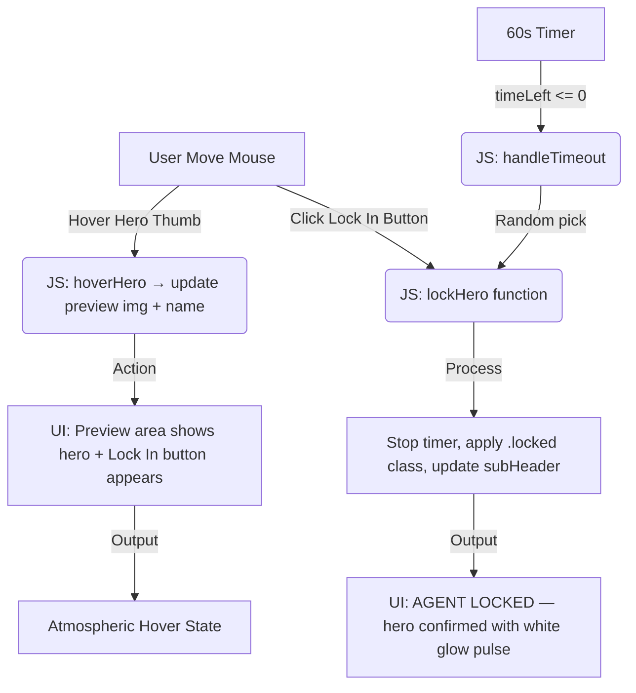

# PROJECT RECORD — Hero Faction Screen
AI 201 — Assignment 1

---

## 1. Design Intent

**Theme:** Call of Duty: Task Force 141 / Overwatch Hero Selection Vibe
**Mood:** Dark, tactical, cinematic

**Visual Rules:**
- **Background:** Dark atmospheric multi-layer gradient with carbon fibre texture and space photography
- **Typography:** `Teko` (Google Fonts) — bold, italic, all-caps, angled for aggressive/futuristic feel
- **Color Palette:**
  - `--ow-orange: #f99e1a` — accent/highlight color
  - `--ow-blue: #405275` — secondary
  - `--ow-light-blue: #00aeff` — glow/neon
  - `--bg-dark: #1e1e1e` — base background
- **Hover Behavior:**
  - Unselected hero thumbs: `grayscale(100%)` + dim (`brightness(0.6)`)
  - On hover: full color, scale up 120%, translateY(-20px), orange border + glow
  - Cards are skewed `(-12deg)` for dynamic, sharp aesthetic
- **Lock-In:** Pulsing white glow animation, timer stops, header updates to "AGENT LOCKED"
- **Timeout:** 60-second countdown; on expiry, random hero is auto-assigned

---

## 2. Mermaid Diagram — System Flow



---

## 3. File Structure

```
/Claude
├── index.html          # Main UI — hero gallery, preview area, top bar
├── css/
│   └── style.css       # All visual styling, animations, layout
├── js/
│   └── app.js          # Timer logic, hover/lock interactions
├── docs/
│   ├── Creative Computing with AI-AI-201-A01.pdf
│   └── Document.pdf
├── README.md           # Assignment write-up (design intent, AI log, reflection)
└── PROJECT_RECORD.md   # This file
```

---

## 4. Source Code Summary

### `index.html`
- Top bar: `SELECT YOUR HERO` header + 60-second countdown timer
- Preview area: large circular portrait (`#preview-img`), hero name (`#preview-name`), `Lock In` button
- Gallery: 5 hero thumbs (Ghost, Capt. Price, Soap, Gaz, Alejandro) using Unsplash portrait images
- Events: `onmouseenter` → `hoverHero()`, `onmouseleave` → `leaveHero()`, `onclick` → `lockHero()`

### `css/style.css`
- Multi-layer body background: carbon fibre texture + space photo + radial gradients
- `@keyframes heroSelectEntrance` — header slides in from left with skew + blur
- `@keyframes subHeaderEntrance` — sub-header fades in from left
- `@keyframes timerEntrance` — timer drops in from top
- `.hero-thumb` — skewed card with grayscale filter; hover lifts + colorizes + orange glow
- `.hero-thumb.locked` — white glow pulse animation (`lockPulse`)
- `#lock-btn` — skewed orange button, `popIn` animation on show, `lockedFlash` on lock

### `js/app.js`
| Function | Description |
|---|---|
| `setInterval` (timer) | Counts down from 60; turns red at ≤10s; calls `handleTimeout()` at 0 |
| `handleTimeout()` | Picks a random `.hero-thumb`, calls `hoverHero()` + `lockHero()` automatically |
| `hoverHero(el, name, imgUrl)` | Updates preview image/name, shows Lock In button |
| `leaveHero()` | No-op — keeps preview active so user can click Lock In |
| `lockHero()` | Locks selection, stops timer, applies locked styles, logs to console |

---

## 5. AI Direction Log

| # | Date | Prompt / Direction |
|---|------|--------------------|
| 1 | 3/25 | Asked AI to initialize a GitHub repository and create a basic `index.html` to test the loop |
| 2 | 3/25 | Directed AI to recreate UI using an "Overwatch" theme — dark gradient, bold italic fonts, grayscale-to-color hover |
| 3 | 3/25 | Asked AI to generate a Mermaid diagram to document the system flow for the assignment rubric |

---

## 6. Records of Resistance

| # | Moment | Description |
|---|--------|-------------|
| 1 | Font choice | AI used a standard font; corrected by requesting "something that looks great" → led to `Teko` |
| 2 | Background | AI initially suggested a simple blue background; rejected in favor of dark atmospheric gradient |
| 3 | *(pending)* | Waiting for next design decision moment |

---

## 7. Five Questions Reflection

*(To be completed before final submission on 4/8)*

---

## 8. External Resources Used

| Resource | Purpose |
|----------|---------|
| [Google Fonts — Teko](https://fonts.google.com/specimen/Teko) | Display typography |
| [Unsplash](https://unsplash.com) | Hero portrait images (Ghost, Price, Soap, Gaz, Alejandro) |
| [Transparent Textures — carbon-fibre](https://www.transparenttextures.com/) | Body background texture overlay |
| Unsplash space photo (`photo-1451187580459`) | Background base image |
