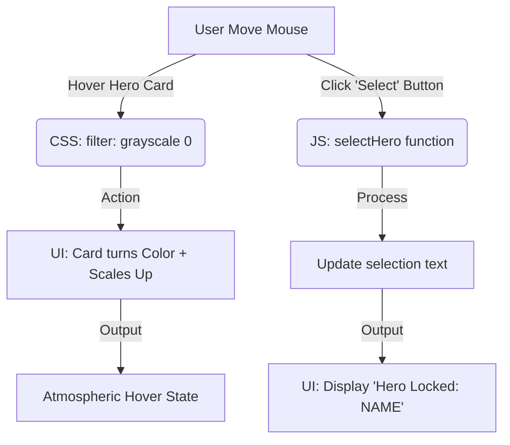

# The "Hero Faction" Screen
AI 201 — Assignment 1

## 1. Design Intent
**Mood:** Overwatch Hero Selection Vibe.
**Visual Rules:**
* **Background:** A dark, atmospheric gradient (`linear-gradient(135deg, #1e1e1e, #000000)`).
* **Typography:** Bold, angled, all-caps sans-serif (`Teko` font from Google Fonts) to create an aggressive, futuristic feel.
* **Hover Behavior:** 
    * Unselected heroes are grayscale (`grayscale(100%)`) and slightly faded.
    * When hovered, the hero card scales up by 10%, goes from grayscale to full color, and gets a bright "Overwatch Orange" (`#f99e1a`) border and glow.
    * The entire card is skewed (`-5deg`) for a dynamic, sharp aesthetic.

## 2. Mermaid Diagram
This flowchart describes the system's input (user interaction), processing (CSS/JS), and output (UI updates).

## 3. AI Direction Log (3-5 entries)
*   **Entry 1 (3/25):** Asked AI to initialize a GitHub repository and create a basic `index.html` file to test the "loop."
*   **Entry 2 (3/25):** Directed AI to recreate the UI using an "Overwatch" theme. Specified a dark gradient, bold italic fonts, and a grayscale-to-color hover effect.
*   **Entry 3 (3/25):** Asked AI to generate a Mermaid diagram to document the system flow for the assignment rubric.

## 4. Records of Resistance (3 moments)
*   **Moment 1:** AI initially suggested a simple blue background. I rejected this and insisted on a "dark gradient" to better match the Overwatch vibe.
*   **Moment 2:** AI used a standard font. I corrected it by asking for "something that looks great," which led to the selection of the angled `Teko` font.
*   **Moment 3:** (Waiting for your next design decision...)

## 5. Five Questions Reflection
(To be completed before final submission on 4/8)
