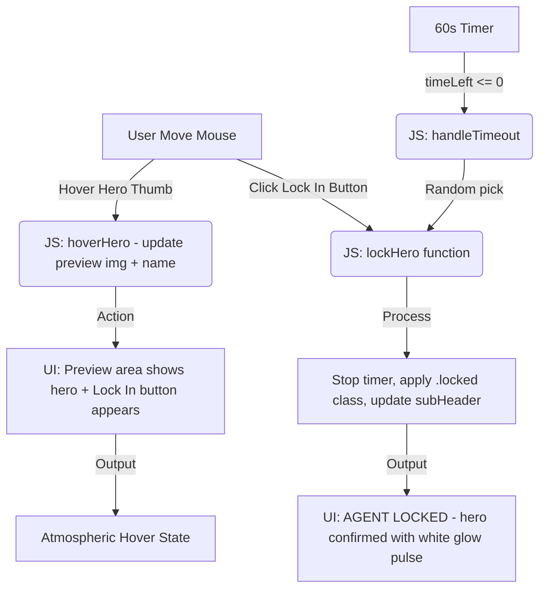

# Hero Select Screen
**AI 201 - Assignment 1** | Viren Chauhan

---

## 1. Project Overview

An interactive hero selection screen styled after Overwatch. The user hovers over one of five agent cards (Ghost, Capt. Price, Soap, Gaz, Alejandro), a cinematic preview area updates in real time, and they must lock in a choice before a 60-second countdown expires. If time runs out, a random agent is auto-assigned.

**Stack:** Vanilla HTML / CSS / JavaScript - no frameworks, no audio files. All sound is synthesized in real time using the Web Audio API.

**Live features:**
- Grayscale-to-color hover transitions on skewed hero cards
- 60-second countdown with urgency stinger at 10 s, per-tick click sounds 9 to 1
- Lock-in cinematic: screen flash, portrait slam, shockwave rings, shooting-star burst, orbiting particles, "AGENT LOCKED" banner
- Fully procedural audio engine: ambient drone chord, heartbeat, hover ping, and a layered lock sound (thud + whoosh + metallic ring + A-major chord stab)
- Auto-timeout assigns a random hero if no selection is made

---

## 2. System Flow (Mermaid)



---

## 3. What I Asked AI to Do - and What It Produced

| # | Date | Prompt I Gave AI | What AI Produced |
|---|------|------------------|------------------|
| 1 | 3/25 | "Initialize a GitHub repo and create a basic index.html to test the loop" | Scaffolded repo, created a minimal HTML page with a placeholder heading and a hero list using `<ul>` and `<li>` tags |
| 2 | 3/25 | "Recreate the UI in an Overwatch theme - dark gradient, bold italic fonts, grayscale-to-color hover" | Full CSS rewrite with dark background, `Teko` font, `grayscale(100%)` cards, orange hover glow, skewed cards |
| 3 | 3/25 | "Generate a Mermaid diagram documenting the system flow" | A basic `graph TD` diagram showing hover, preview, lock, output |
| 4 | 3/30 | "Add a 60-second countdown timer that auto-assigns a random hero on expiry" | JS `setInterval` timer, red color change at 10 s, `handleTimeout()` with random selection |
| 5 | 3/30 | "Animate the lock-in moment - make it cinematic" | Screen flash overlay, `.lock-anim` CSS keyframes on portrait and name, `.locked` pulsing glow on the hero thumb |
| 6 | 4/6 | "Add sound - make the whole thing feel like a real game" | Full Web Audio API `SoundEngine` module: ambient drone, heartbeat, shimmer tones, urgency stinger, per-tick click, and a layered 4-phase lock sound |

---

## 4. Records of Resistance - Three Moments I Rejected or Revised AI Output

### Moment 1 - Background: Blue Was the Wrong Vibe

**What AI produced:** A plain `background: #1e3a5f` (dark blue) for the body. Clean, safe, generic.

**Why I rejected it:** It looked like a corporate dashboard, not a tactical operator screen. The whole point was a dark, cinematic atmosphere - like a game's loading screen, not a SaaS app.

**What I did instead:** I directed AI to layer a multi-part background: a carbon-fibre tile texture from Transparent Textures on top of a space photograph from Unsplash, with radial gradients on top of both. The result is a deep, textured darkness that reads immediately as military/sci-fi.

```css
/* What AI gave me first */
background: #1e3a5f;

/* What I pushed it to build */
background:
    radial-gradient(circle at center, rgba(0,174,255,0.05) 0%, transparent 70%),
    url('https://www.transparenttextures.com/patterns/carbon-fibre.png'),
    radial-gradient(circle at center, rgba(40,60,90,0.4) 0%, rgba(5,10,20,0.95) 100%),
    url('https://images.unsplash.com/photo-1451187580459...');
```

---

### Moment 2 - Font: Generic Sans-Serif Was Not Enough

**What AI produced:** Default styling without specifying a font - the browser rendered everything in system sans-serif (usually Arial or Helvetica). The typography had zero personality.

**Why I rejected it:** Typography is the first thing that signals genre. Overwatch uses heavy, angled, condensed lettering for its HUD. A generic font completely destroyed the aesthetic.

**What I did instead:** I told AI to find a font that "looks aggressive and futuristic." It suggested `Teko` from Google Fonts - a tall, condensed display face. I kept that suggestion but added `font-style: italic` and `text-transform: uppercase` everywhere, and pushed `letter-spacing` up to reinforce the aggressive feel. The result matched the Overwatch HUD energy I was going for.

---

### Moment 3 - Lock Banner Text: AI Got the Wording Wrong

**What AI produced:** When the user clicked Lock In, the status text read `"Hero Locked: [NAME]"` - phrasing that matched a generic game UI pattern AI had likely seen many times.

**Why I rejected it:** The project's theme is military operators. Calling them "Heroes" in the confirmation message broke the fiction. The sub-header should feel like a military comms system.

**What I did instead:** I manually changed the confirmation wording to `"AGENT LOCKED"` for the animated banner and the sub-header, and directed AI to update `handleTimeout()` to say `"TIME EXPIRED! RANDOM AGENT ASSIGNED: [NAME]"`. This is documented in commit `431f333 fixed the lock agent text`.

---

## 5. Annotated Commits - Key Decision Points

| Commit | What Changed | Why It Matters |
|--------|-------------|----------------|
| `bd5d691` | Setup GitHub Actions and upgrade UI | First AI-generated full page - baseline everything was built on |
| `4421d98` | Animated the lock screen | First cinematic moment; AI added the flash overlay and `lock-anim` keyframes |
| `f0c5201` | Sounds | Entire Web Audio API engine added - the biggest single AI output in the project |
| `431f333` | Fixed the lock agent text | Rejection Moment 3 - changed "Hero Locked" to "AGENT LOCKED" to match military theme |
| `a38ada3` | Update index.html | Final hero image swap from Unsplash to Pexels for better portrait compositions |

---

## 6. File Structure

```
/Claude
├── index.html          # Main UI - top bar, preview area, hero gallery, overlays
├── css/
│   └── style.css       # All styling, keyframe animations, responsive sizing
├── js/
│   └── app.js          # SoundEngine module, timer, hoverHero, lockHero, cinematic logic
├── docs/
│   ├── Creative Computing with AI-AI-201-A01.pdf
│   └── Document.pdf
├── README.md           # This file
└── PROJECT_RECORD.md   # Detailed source code breakdown and AI direction log
```

---

## 7. Five Questions Reflection

**1. What did you use AI for, and did it do what you expected?**
I used AI as a fast prototyping partner - give it a visual concept, get working code back quickly. It did produce working code on almost every request, but "working" and "right" are different things. The first pass was always functional but never felt like what I had in my head. I had to push hard on every visual decision.

**2. Where did you have the most creative control?**
Direction and rejection. AI doesn't know what vibe a project needs - it knows what patterns look like in training data. Every time the output felt generic (blue background, system font, "Hero Locked" text), I was the one who recognized it was wrong and articulated why. The creative authority was always mine; AI just executed.

**3. What surprised you about how AI writes code?**
The Web Audio API sound engine surprised me most. I asked for "game-like sound" and AI built a fully layered procedural audio system - ambient drone chords, LFO oscillators for shimmer, a synthetic reverb, a 4-phase lock sound timed to visual events. That level of technical specificity from a single prompt was genuinely unexpected.

**4. What did AI get wrong most often?**
Tone and context. AI consistently defaulted to neutral, safe choices - the kind of UI that could fit any project. It had no sense that this was specifically military-themed versus fantasy-themed versus sci-fi. Every contextual refinement (word choice, color intensity, animation aggression) required explicit prompting from me.

**5. How has this changed how you think about AI in creative work?**
AI is a skilled but uncritical executor. It can build almost anything you can describe in enough detail, but it has no taste - no sense of whether the result feels right. The real creative skill when working with AI isn't prompting; it's knowing what bad output looks like and being able to articulate why it's wrong. Rejection is a skill. The three moments I documented above weren't failures - they were me doing my job as the designer.

---

## 8. External Resources

| Resource | Purpose |
|----------|---------|
| [Google Fonts - Teko](https://fonts.google.com/specimen/Teko) | Display typography |
| [Pexels](https://www.pexels.com) | Hero portrait images (Ghost, Price, Soap, Gaz, Alejandro) |
| [Transparent Textures - carbon-fibre](https://www.transparenttextures.com/) | Body background texture overlay |
| Unsplash space photo (`photo-1451187580459`) | Background base image |
| Web Audio API (native browser) | All sound - no audio files loaded |
